# QAVACH: PQC-Powered Resilient E-Governance Architecture

**QAVACH** (Hindi for *Armour*) is a next-generation digital service delivery framework designed for the future of Indian e-governance. It addresses the "Triple Threat" of modern digital states—Data Integrity, Availability, and Privacy—by implementing a **Zero-Trust Architecture** powered by **NIST-standardized Post-Quantum Cryptography (PQC)**.

---

## 🏛️ Vision & Problem Statement

As governments transition to "Digital First" models, traditional central identity registries have become high-value targets. A single breach of a central database can compromise millions of citizen records. Furthermore, the impending "Quantum Harvest" (Store now, Decrypt later) threat makes today's RSA and ECDSA-based signatures vulnerable to future decryption.

**QAVACH solves this by:**
1. **Decentralizing Proofs:** Using **Policy-Gated Credential Attestation (PGCA)**, where verification happens on the citizen's device, not a server.
2. **Post-Quantum Security:** Transitioning signing and encryption to NIST FIPS 203/204/205 standards (ML-KEM, ML-DSA, SLH-DSA).


3. **Selective Disclosure:** Allowing citizens to prove eligibility (e.g., "Income < 3L") without sharing the original document or PII.
4. **CBOM (Cryptography Bill of Materials):** Providing a real-time compliance dashboard for government CISOs to track the migration of state departments to PQC.

---

## 🏗️ System Architecture

QAVACH is a multi-layered ecosystem comprising five distinct components:


### 1. GovSign API (The Cryptographic Backbone)
A high-performance microservice that government departments call to sign document hashes.
- **Algorithms:** ML-DSA-65 (FIPS 204) for fast signing, SLH-DSA-SHAKE-128s (FIPS 205) for archival.
- **CBOM Engine:** Logs every operation to a tamper-evident registry, identifying "at-risk" (classical) departments.


### 2. Mock Issuer CA (The Mock Government)
Simulates document issuance for departments like Income Tax (ITD), UIDAI, and Revenue.
- **Onboarding:** Integrates with the QAVACH app to issue PQC-signed credentials.

### 3. QAVACH Mobile Wallet (The Citizen's Armour)
A Flutter-based mobile application that acts as a secure container for citizen credentials.
- **On-Device Policy Engine:** Runs Open Policy Agent (OPA) Rego policies to evaluate claims locally.
- **Secure Enclave:** Stores keys and documents encrypted with **ML-KEM-768 + AES-256-GCM**. Private keys never leave the device.

### 4. Verifier Portals (The Consumer Ecosystem)
A set of five demonstration portals:
- **Scholarship & Home Loan:** PQC-enabled, using QR-based selective disclosure.
- **Land Mutation:** Shows a migration warning for classical credentials.
- **Ration Card & Trade Licence:** Legacy portals that demonstrate the risks of "Classical-only" architectures.

### 5. CBOM Dashboard (The Auditor's View)
A React-based "Command Centre" visualizing the national PQC migration status.

---

---

## 🔐 Cryptographic Principles & Mathematical Foundation

QAVACH implements a multi-algorithm defense strategy based on the final NIST Post-Quantum Cryptography standards (FIPS 203, 204, and 205). Our architecture is original in its application of **Policy-Gated Credential Attestation (PGCA)**, which bridges the gap between high-assurance integrity and granular privacy.

### 1. Module Lattice-Based Cryptography (ML-DSA & ML-KEM)
Most of the system's interactive operations rely on the **Module Learning with Errors (MLWE)** problem. Unlike classical RSA (integer factorization) or ECC (elliptic curve discrete logarithms), MLWE-based schemes are conjectured to be resistant to Shor's algorithm.

#### ML-KEM (Kyber): Secure Key Exchange
Used for key encapsulation in secure document storage. It enables the derivation of a shared symmetric key (AES-256) without direct transmission of the key.


- **The Math:** Security is based on the hardness of finding a secret vector `s` in a lattice given `A` and `t = As + e`, where `e` is a small error term. 

#### ML-DSA (Dilithium): Digital Signatures
Used for citizen attestation and real-time signing. It provides a balance of signature size and computational efficiency.


- **Originality:** QAVACH uses Dilithium's "Fiat-Shamir with Aborts" construction to ensure that the signature does not leak any information about the secret key lattice structure.

### 2. Stateless Hash-Based Signatures (SLH-DSA)
For long-term document archival, we utilize **SLH-DSA (SPHINCS+)**. 


- **Originality in Integrity:** Unlike lattice-based schemes, SLH-DSA relies solely on the security of the underlying cryptographic hash function (e.g., SHAKE-128). This provides a critical safety net against potential future mathematical breakthroughs in lattice cryptanalysis.


- **The Structure:** It builds upon a hypertree hierarchy of Merkle trees (FORS trees), ensuring that even if one component is compromised, the overall integrity remains "Quantum Immutable."

### 3. Selective Disclosure via On-Device Policy Evaluation
The technical originality of QAVACH lies in the decoupling of *Identity* from *Attestation*.


- **The PGCA Protocol:** Instead of transmitting a PII-heavy document to a verifier, the verifier transmits an **Open Policy Agent (OPA) Compiled Policy (WASM)** and a unique challenge (nonce). 
- **Local Execution:** The QAVACH app executes this policy against the citizen's decrypted record in a local secure context. 
- **Mathematical Attestation:** The resulting signature (ML-DSA-44) covers the `(Nonce, PolicyID, BooleanResult)`. This mathematically proves that a trusted document satisfied a specific policy without revealing any document attributes to the verifier or host server.


---

## 📊 CBOM Dashboard: Real-time National Audit

QAVACH implements the world's first live **Cryptography Bill of Materials (CBOM)** for e-governance. It provides an automated inventory of every cryptographic algorithm used across government departments.

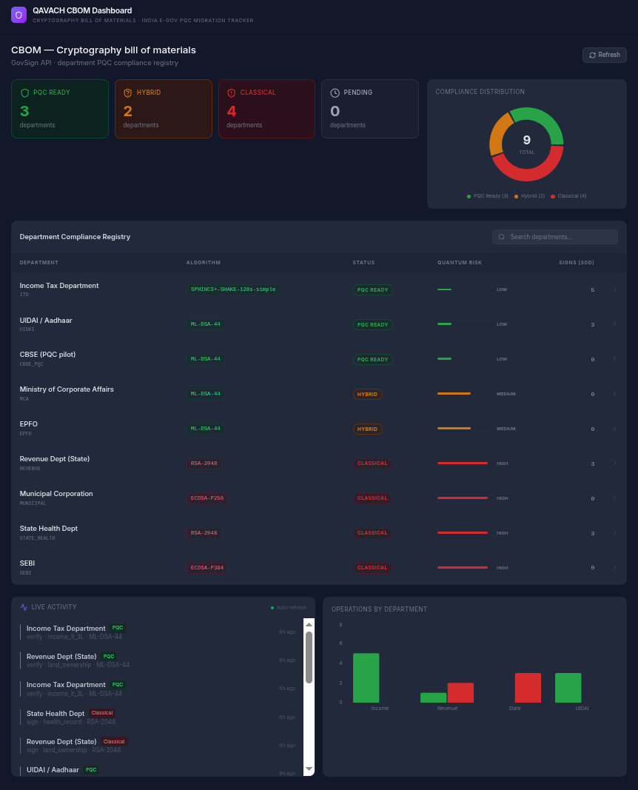

The dashboard allows CISOs to identify "Migration Gaps" and prioritize departments requiring urgent PQC upgrades.

---

## 🛡️ Resilience in Action: Robust Error Handling

Security is not just about the "Happy Path." QAVACH is designed to handle policy failures and tampering gracefully on the device.

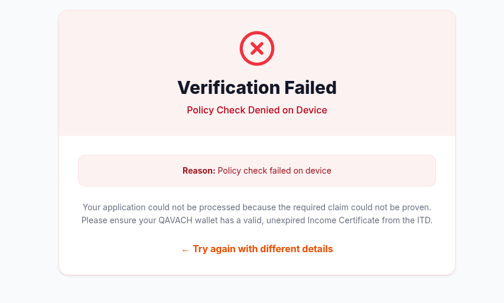

---

## 🔐 Cryptography Specification


| Primitive | Standard | Role | Resilience Basis |
| :--- | :--- | :--- | :--- |
| **ML-DSA** | FIPS 204 | Interactive Attestation | Module Learning with Errors (MLWE) |
| **SLH-DSA** | FIPS 205 | Archival Signing | Cryptographic Hash Function Security |
| **ML-KEM** | FIPS 203 | Key Encapsulation | MLWE-based Key Exchange |
| **AES-256-GCM** | — | At-Rest Encryption | Authenticated Encryption with Galois Mode |



---

---

## 📂 Repository Structure

- `services/govsign/`: FastAPI PQC signing microservice.
- `services/mock-ca/`: Simulates government issuers.
- `qavach_app/`: Flutter mobile wallet (Android).
- `dashboard/`: React CBOM compliance dashboard.
- `portals/`: 5 Verifier portals (Scholarship, Home Loan, Land Mutation, Ration Card, Trade Licence).

---

## 🛠️ Getting Started

For detailed setup and testing instructions, please refer to:
- 📜 **[DEPLOYMENT.md](DEPLOYMENT.md)**: Steps to replicate the full stack.
- 🛡️ **[SECURITY.md](SECURITY.md)**: Security audit and architecture deep-dive.

---

## 🏆 Hackathon Demo Script

1. **The PQC Path:** Scan the Scholarship QR with the QAVACH app. See the on-device "Policy Check" animation. Observe the "Verified - PQC Safe" result on the portal.
2. **The Legacy Path:** Open the Ration Card portal. Notice the "Classical Risk" warning. Upload a document and see the CBOM dashboard turn Red for the Revenue Dept.
3. **The CBOM View:** Point to the Dashboard. Say: *"We've inventoried the state's cryptography. We know exactly where the vulnerabilities are, and we've built the PQC path to fix them."*

---
© 2026 Team 10.00% | QAVACH - Resilient E-Governance for a Quantum Future
